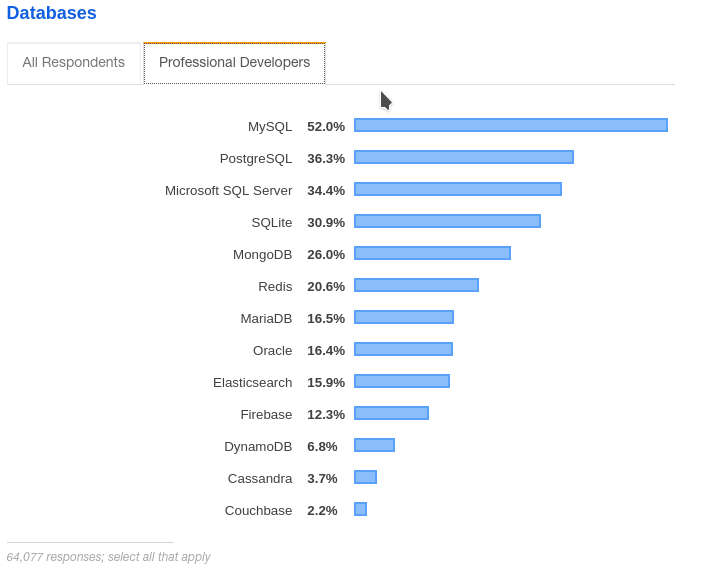

# 🍃 MongoDB

MongoDB es un gestor de bases de datos NoSQL multiplataforma orientada a **Documentos,** distribuidas y de uso general que ha sido diseñada para el desarrollo de aplicaciones moderno y para la era de la nube**. **Esto nos quiere decir que en lugar de guardar los datos en registros, guarda los datos en documentos. Estos documentos son almacenados en un tipo de datos [**BJSON**](http://bjson.org), que es una representación binaria del tipo de dato estructurado [**JSON**](https://www.json.org/json-en.html). MongoDB esta escrito en C++, lo que le da un rápida ejecución de tareas o procesos contando con una gran cercania a los recursos de hardware de la máquina. Además, MongoDB esta licenciado como[ GNU AGPL v3.0](https://www.mongodb.com/community/licensing) de la Fundación de Software Libre (Free Software Fundation), de modo que se trata de un software de licencia libre .

MongoDB es el gestor de bases de datos NoSQL más popular y utilizados por la comunidad de desarrollo de software mundial según los datos recaudados por la encuesta de Stack Overflow del año 2019, una de las comunidades de colaboración para desarrolladores más popular del mundo. Donde aproximadamente el **26%** de desarrolladores profesionales del mundo usan MongoDB en su stack de desarrollo, siendo el más utilizado por encima de **Redis**, un gestor NoSQL de tipo **key-value**.

Es importante destacar que las bases de datos SQL relacionales, como **MySQL** y **PostgreSQL**, han liderado por mucho años como los gestores de bases de datos más utilizados en la industria del desarrollo, pero también es cierto que los gestores NoSQL están teniendo una mayor tendencia en los últimos años, tal es el caso que para el año 2019 en el top 10 de los gestores mas usados se encuentran 5 gestores como **Couchbase**, **Cassandra**, **DynamoDB**, **Redis** y **MongoDB.**&#x20;

Las características más importantes de MongoDB por las cuales la hacen preferida dentro de los gestores NoSQL son su su **velocidad** y su rico pero sencillo **sistema de consulta** de los contenidos de la base de datos. No es exagerado decir que alcanza un balance prefecto entre rendimiento y funcionalidad, incorporando muchos de los tipos de consultas habitualmente utilizados en los modelos relacionales, pero sin sacrificar en rendimiento.

#### Alto rendimiento

MongoDB proporciona persistencia de datos de alto rendimiento. En particular, La compatibilidad con modelos de datos integrados reduce la actividad de E/S en el sistema de base de datos. Los índices admiten consultas más rápidas y pueden incluir claves de documentos y matrices incrustados

