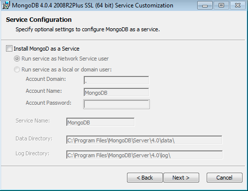

# Instalación y Configuración

## **Instalación de MongoDB Community Edition en Ubuntu**

Para instalar MongoDB 4.2 Community Edition en versiones LTS \(soporte a largo plazo\) de Ubuntu Linux se utiliza el administrador de paquetes apt.

### **Consideraciones**

Respecto al soporte de la plataforma, MongoDB 4.2 Community Edition admite las siguientes versiones de Ubuntu LTS de 64 bits en la arquitectura x86\_64:

* 18.04 LTS \("Biónic"\)
* 16.04 LTS \("Xenial"\)

MongoDB solo admite las versiones de 64 bits de estas plataformas.

MongoDB 4.2 Community Edition en Ubuntu también es compatible con las arquitecturas ARM64 y s390x en plataformas seleccionadas.

### **Paquetes oficiales de MongoDB**

Para instalar MongoDB Community en su sistema Ubuntu, se utiliza el paquete oficial mongodb-org, el cual es mantenido y respaldado por MongoDB Inc. El paquete oficial mongodb-org siempre contiene la última versión de MongoDB, y está disponible repositorio dedicado.

El paquete mongodb proporcionado por Ubuntu no es mantenido por MongoDB Inc. y entra en conflicto con el paquete oficial mongodb-org. Si ya se instaló el paquete mongodb en Ubuntu, primero se debe desinstalar el paquete mongodb, antes de proceder con la instalación de mongodb-org.

### Instalar MongoDB Community Edition

Se sigue estos pasos para instalar MongoDB Community Edition utilizando el administrador de paquetes apt.

### 1. Importar la clave pública utilizada por el sistema de gestión de paquetes.

Desde un terminal, emita el siguiente comando para importar la clave GPG pública MongoDB desde [https://www.mongodb.org/static/pgp/server-4.2.asc](https://www.mongodb.org/static/pgp/server-4.2.asc):

```bash
wget -qO - https://www.mongodb.org/static/pgp/server-4.2.asc | sudo apt-key add -
```

La operación debería dar como resultado un Ok, Sin embargo si aparece un error indicando que gnupg no está instalado, se puede:

1. Instalar gnupg y las librerías requeridas, usando el siguiente comando:

```bash
sudo apt-get install gnupg
```

2.  Una vez, instalado , re intentar la importación de la llave:

```bash
wget -qO - https://www.mongodb.org/static/pgp/server-4.2.asc | sudo apt-key add -
```

### 2. Crear una lista de archivos para MongoDB

Dependiento de la versión de Ubuntu, ejecute alguno de los siguientes comandos. Si no está seguro de qué versión de Ubuntu está ejecutando el host, abra una terminal o shell en el host y ejecute lsb\_release -dc.

#### Ubuntu 18.04 \(Bionic\)

```bash
echo "deb [ arch=amd64,arm64 ] https://repo.mongodb.org/apt/ubuntu bionic/mongodb-org/4.2 multiverse" | sudo tee /etc/apt/sources.list.d/mongodb-org-4.2.list
```

#### Ubuntu 16.04 \(Xenial\)

```bash
echo "deb [ arch=amd64,arm64 ] https://repo.mongodb.org/apt/ubuntu xenial/mongodb-org/4.2 multiverse" | sudo tee /etc/apt/sources.list.d/mongodb-org-4.2.list
```

### 3. Recargar paquete de base de datos local

Emita el siguiente comando para volver a cargar la base de datos del paquete local:

```bash
sudo apt-get update
```

### 4. Instalar las bases de datos de MongoDB

```bash
sudo apt-get install -y mongodb-org
```

Opcional. Aunque puede especificar cualquier versión disponible de MongoDB, apt-get se debe actualizar los paquetes cuando esté disponible una versión más nueva. Para evitar actualizaciones no deseadas, puede anclar el paquete en la versión instalada actualmente:

```bash
echo "mongodb-org hold" | sudo dpkg --set-selections
echo "mongodb-org-server hold" | sudo dpkg --set-selections
echo "mongodb-org-shell hold" | sudo dpkg --set-selections
echo "mongodb-org-mongos hold" | sudo dpkg --set-selections
echo "mongodb-org-tools hold" | sudo dpkg --set-selections
```

## **Instalación de MongoDB Community Edition en** Debian

Se sigue estos pasos para instalar MongoDB Community Edition utilizando el administrador de paquetes apt.

### 1. Importar la clave publica usada por el sistema administrador de paquetes

Desde un terminal, emita el siguiente comando para importar la clave GPG pública MongoDB desde [https://www.mongodb.org/static/pgp/server-4.2.asc](https://www.mongodb.org/static/pgp/server-4.2.asc):

```bash
wget -qO - https://www.mongodb.org/static/pgp/server-4.2.asc | sudo apt-key add -
```

La operación debería dar como resultado un Ok, Sin embargo si aparece un error indicando que gnupg no está instalado, se puede:

1. Instalar gnupg y las librerías requeridas, usando el siguiente comando:

```bash
sudo apt-get install gnupg
```

2.  Una vez, instalado , re intentar la importación de la llave:

```bash
wget -qO - https://www.mongodb.org/static/pgp/server-4.2.asc | sudo apt-key add -
```


### 2. Cree un archivo /etc/apt/sources.list.d/mongodb-org-4.2.list para MongoDB

Cree el archivo de lista usando el comando apropiado para su versión de Debian:

**Debian 10 "Buster"**

```bash
echo "deb http://repo.mongodb.org/apt/debian buster/mongodb-org/4.2 main" | sudo tee /etc/apt/sources.list.d/mongodb-org-4.2.list
```

**Debian 9 "Stretch"** 

```bash
sudo apt-get install -y mongodb-org=4.2.7 mongodb-org-server=4.2.7 mongodb-org-shell=4.2.7 mongodb-org-mongos=4.2.7 mongodb-org-tools=4.2.7
```

Si solo instala mongodb-org = 4.2.7 y no incluye los paquetes de componentes, la última versión de cada paquete MongoDB se instalará independientemente de la versión que especifique.

Opcional. Aunque puede especificar cualquier versión disponible de MongoDB, apt-get actualizará los paquetes cuando esté disponible una versión más nueva. Para evitar actualizaciones no deseadas, puede anclar el paquete en la versión instalada actualmente:

```bash
echo "mongodb-org hold" | sudo dpkg --set-selections
echo "mongodb-org-server hold" | sudo dpkg --set-selections
echo "mongodb-org-shell hold" | sudo dpkg --set-selections
echo "mongodb-org-mongos hold" | sudo dpkg --set-selections
echo "mongodb-org-tools hold" | sudo dpkg --set-selections
```

## **Instalación de MongoDB Community Edition en Windows**

### Método de instalación

Se instala MongoDB en Windows utilizando el asistente de instalación predeterminado. Alternativamente, puede optar por instalar MongoDB en Windows de forma desatendida, utilizando msiexec.exe desde la línea de comandos \(cmd.exe\). Esto es útil para los administradores de sistemas que deseen implementar MongoDB utilizando la automatización

### Prerrequisitos

Los usuarios de versiones de Windows anteriores a Windows 10 deben instalar la siguiente actualización antes de instalar MongoDB:



Los usuarios de Windows 10, Server 2016 y Server 2019 no necesitan esta actualización.

### Procedimiento

Siga estos pasos para instalar MongoDB Community Edition utilizando el asistente de instalación de MongoDB. El proceso de instalación instala tanto los binarios de MongoDB como el archivo de configuración predeterminado   bin  mongod.cfg.

### 1 Descargue el instalador 

 Descargue el instalador MSI de la comunidad MongoDB desde el siguiente enlace:



* En el menú desplegable Versión, seleccione la versión de MongoDB para descargar. 
* En el menú desplegable del sistema operativo, seleccione Windows x64. 
* En el menú desplegable Paquete, seleccione MSI. 
* Haz clic en Descargar.

###  2 Ejecute el instalador de MongoDB. 

Por ejemplo, desde el Explorador de Windows / Explorador de archivos:

* Vaya al directorio donde descargó el instalador de MongoDB \(archivo .msi\). Por defecto, este es su directorio de Descargas.
* Haga doble clic en el archivo .msi. 

### 3 Siga el asistente de instalación de MongoDB Community Edition. 

El asistente lo guiará a través de la instalación de MongoDB y MongoDB Compass.

* **Elija el tipo de configuración**

   Puede elegir el tipo de configuración Completo \(recomendado para la mayoría de los usuarios\) o Personalizado. La opción de configuración Completa instala MongoDB y las herramientas de MongoDB en la ubicación predeterminada. La opción de configuración personalizada le permite especificar qué ejecutables están instalados y dónde.

* **Configuración de servicio** 

  A partir de MongoDB 4.0, puede configurar MongoDB como un servicio de Windows durante la instalación o simplemente instalar los binarios.

#### MongoDB Service

_Lo siguiente instala y configura MongoDB como un servicio de Windows._

A partir de MongoDB 4.0, puede configurar e iniciar MongoDB como un servicio de Windows durante la instalación, y el servicio MongoDB se inicia después de una instalación exitosa.


Seleccione Instalar MongoD como servicio MongoDB como servicio.

Seleccione cualquiera:

Ejecute el servicio como usuario del servicio de red \(predeterminado\)

Esta es una cuenta de usuario de Windows integrada en Windows

Ejecute el servicio como usuario local o de dominio.

Para una cuenta de usuario local existente, especifique un período \(es decir\) para el Dominio de cuenta y especifique el Nombre de cuenta y la Contraseña de cuenta para el usuario. Para un usuario de dominio existente, especifique el Dominio de cuenta, el Nombre de cuenta y la Contraseña de cuenta para ese usuario. Nombre del Servicio. Especifique el nombre del servicio. El nombre predeterminado es MongoDB. Si ya tiene un servicio con el nombre especificado, debe elegir otro nombre.

Directorio de datos. Especifique el directorio de datos, que corresponde a --dbpath. Si el directorio no existe, el instalador creará el directorio y establecerá el acceso al directorio del usuario del servicio.

Directorio de registro. Especifique el directorio de registro, que corresponde a --logpath. Si el directorio no existe, el instalador creará el directorio y establecerá el acceso al directorio del usuario del servicio.

_Lo siguiente solo instala MongoDB y no configura MongoDB como un servicio de Windows._

Si elige no configurar MongoDB como un servicio de Windows, desmarque Instalar MongoD como un servicio.



Instale la brújula MongoDB Para Windows 8 o superior, puede hacer que el asistente instale MongoDB Compass. Para instalar Compass, seleccione Instalar MongoDB Compass \(predeterminado\).

NOTA

El script de instalación requiere PowerShell versión 3.0 o superior. Si tiene Windows 7, desmarque Instalar MongoDB Compass. Puede descargar Compass manualmente desde el Centro de descargas.

### Si instaló MongoDB como un servicio de Windows 

El servicio MongoDB se inicia tras una instalación exitosa 

Para comenzar a usar MongoDB, conecte un shell mongo.exe a la instancia de MongoDB en ejecución. Ya sea:

* Desde el Explorador de Windows / Explorador de archivos, vaya al directorio C:  Archivos de programa  MongoDB  Server  4.2  bin  y haga doble clic en mongo.exe.
* O abra un intérprete de comandos con privilegios administrativos y ejecute:

```bash
"C:\Program Files\MongoDB\Server\4.2\bin\mongo.exe"
```

### Si no instaló MongoDB como un servicio de Windows 

Si solo instaló los ejecutables y no instaló MongoDB como un servicio de Windows, debe iniciar manualmente la instancia de MongoDB.

### Ejecute MongoDB Community Edition como un servicio de Windows 

A partir de la versión 4.0, puede instalar y configurar MongoDB como un servicio de Windows durante la instalación, y el servicio MongoDB se inicia después de una instalación exitosa. MongoDB se configura utilizando el archivo de configuración   bin  mongod.cfg.

