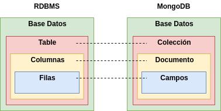

# Colecciones y Documentos

## Base de Datos Documental

Como se lo ha mencionado en secciones previas a esta, MongoDB es un gestor de bases de datos documental donde un registro se denomina **documento,** que es un dato compuesto en pares de campos y valores. Esta forma de estructurl los datos es similar a los objetos **JSON**. Los valores de los campos pueden incluir otros documentos, arreglos y array de documentos.

```javascript
{
  nombre: "Carlos",                     <--- campo: valor
  edad: 25,                             <--- campo: valor
  estado: "A",                          <--- Campo: valor
  grupos: [ "deportes", "tecnologia"],  <--- campo: valor
}
```

Las ventajas de usar documentos son las siguientes:

* Los documentos u objetos corresponden a tipos de datos nativos en muchos lenguajes de programación
* Los documentos y arreglos estructurados reducen la necesidad de costosos joins
* Los esquemas dinámicos admiten un polimorfismo fluido 

## Colecciones

MongoDB almacena y agrupa  los documentos en **colecciones.** Es muy común hacer la analogía con el modelo relacional de las bases de datos SQL, donde una colección es una tabla y un documento un registro o fila dentro de una tabla.



## Principales Características

La forma como se estructura la información le dan un gran rendimiento a este gestor documental. Las principales características de Mongo son:

### Alto rendimiento

MongoDB proporciona persistencia de datos de alto rendimiento. En particular, La compatibilidad con modelos de datos integrados reduce la actividad de E/S en el sistema de base de datos. Los índices admiten consultas más rápidas y pueden incluir claves de documentos y matrices incrustados

### Rico lenguaje de consulta

MongoDB admite un lenguaje de consulta enriquecido para permitir operaciones de lectura y escritura mas conocidas como CRUD \(Create, Read, Update and Delete\) así como agregación de datos que procesan registros y retornan resultados calculados, agrupan valores de multiples documentos  y puede realizar una variedad de operaciones con los datos agrupados para devolver un único resultado. La búsqueda de texto y las consultas geoespaciales son  soportados por este gestor.

### Alta disponibilidad

La alta disponibilidad indica un sistema diseñada para durabilidad, redundancia y conmutación por error automático de modo que las duplicaciones admitidas por el sistema pueden funcionar de manera continua y sin tiempo de inactividad durante un largo periodo de tiempo. Los conjuntos de replicas de MongoDB admiten alta disponibilidad si se aplican las practicas que se encuentran en la documentación oficial.  

Un conjunto de replicas es un grupo de servidores Mongo que mantienen el mismo conjunto de datos, proporcionando redundancia y aumenta la disponibilidad de datos. En pocas palabras estamos hablando de un sistema distribuido que garantiza disponibilidad de los datos.

### Escalabilidad horizontal

Los conjuntos de replicas distribuidos en varios servidores permiten una potente escalabilidad horizontal lo cual lo convierte como parte de de la funcionalidad principal de este gestor. Compartir datos distribuidos a través de un clouster de servidores es uno de las principales razones por lo cual es el gestor de bases de datos NoSQL mas popular en la actualidad.

